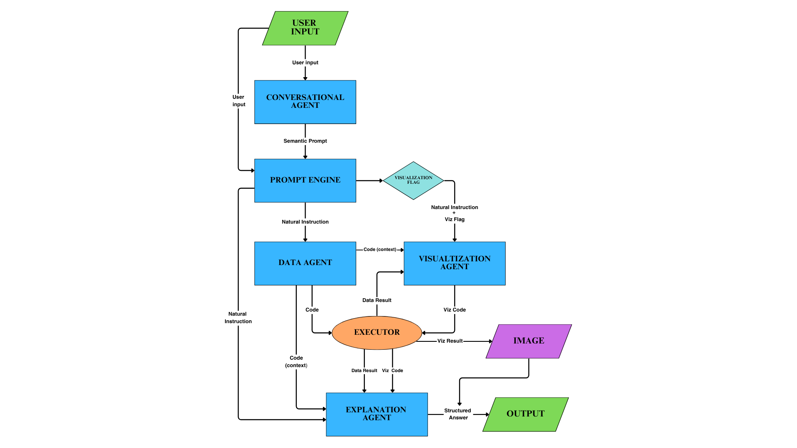
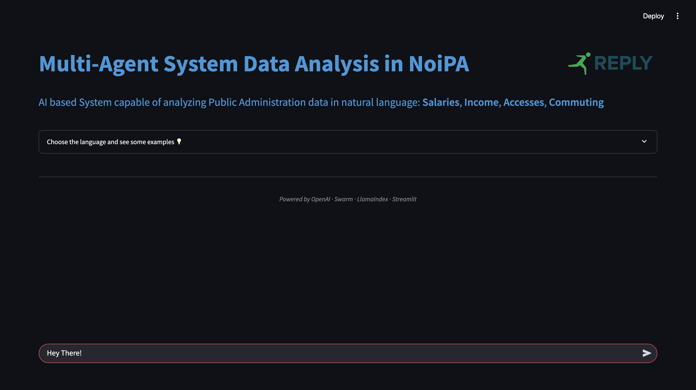
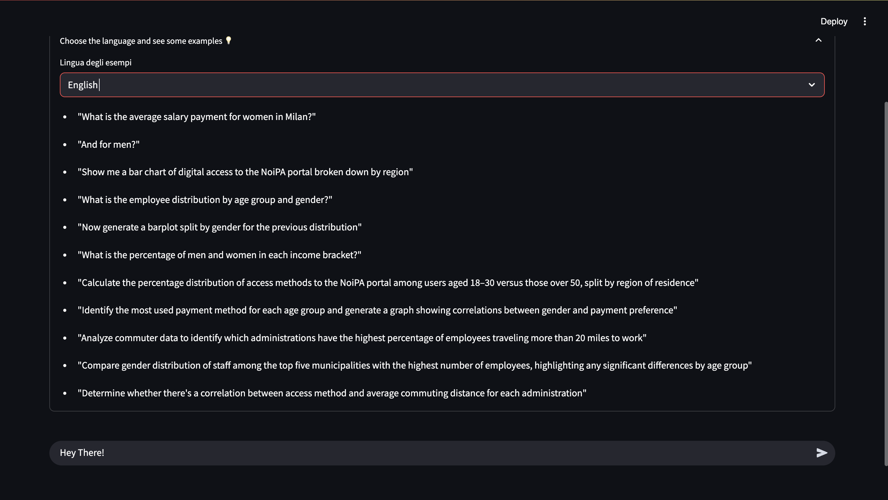
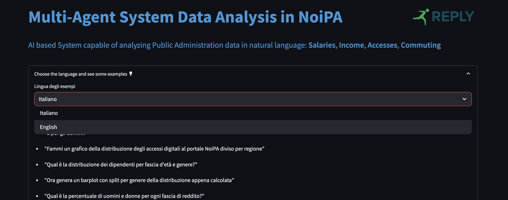

  

## Team Members
- Chiara Canali – Captain (ID: 800031)
- Leonardo Risica (ID: 803741)
- Emiliano Simonelli (ID: 800171)

**Master’s Degree in Data Science and Management**  
LUISS Guido Carli – A.Y. 2024/2025

# 1 - Introduction

SwarmPA is a multi-agent system developed as part of the Machine Learning course (A.Y. 2024/2025) at LUISS Guido Carli, in collaboration with Reply SpA. The project addresses a real-world challenge in the public sector: enabling intuitive, efficient, and explainable access to complex datasets from the Italian Public Administration (PA). These datasets contain rich, granular information about salary distributions, commuting patterns, income brackets, and digital access behaviors of public employees. However, navigating such data typically requires technical expertise and familiarity with programming tools—skills that most public sector workers do not possess.

To bridge this gap, SwarmPA provides an **end-to-end intelligent system** that transforms natural language questions into structured analytical results and visualizations, without requiring any technical input from the user. The system is designed with one clear objective: to **democratize access to public data analytics**, empowering even non-technical users—such as public officials, analysts, or administrative staff—to explore, interpret, and understand institutional patterns and trends.

The system adopts a **multi-agent architecture**, explicitly recommended by Reply SpA, and strategically leverages the capabilities of Large Language Models (LLMs). Each agent is specialized in a specific role, forming a modular and scalable pipeline where tasks are divided, delegated, and executed in a coordinated fashion. This design ensures clarity, robustness, and reusability of the workflow, while maximizing performance through specialization.

At the core of the system lies **Swarm**, an open framework for orchestrating agent-based workflows with LLMs. Swarm provides a lightweight but powerful interface for defining, managing, and coordinating multiple intelligent agents. Its main strength lies in abstracting communication and memory between agents, allowing each component to focus on its expertise while still cooperating as part of a larger process. Swarm was chosen because of its modularity, its native support for prompt-based agents, and its flexibility in handling sequential logic flows—ideal for our goal of chaining reasoning, code generation, execution, and explanation.

The complete analysis pipeline is as follows:
1. **Conversational Agent** – The entry point of the system. It interprets the user’s natural language question, extracts its semantic structure, and aligns it with the metadata and content of the datasets.
2. **Prompt Engine** – It reformulates the parsed intent into a precise, domain-specific instruction, bridging the gap between semantic interpretation and code generation.
3. **Data Agent** – Based on the refined instruction, this agent generates optimized Python code (using `pandas`, `numpy`, etc.) to query, transform, and analyze the relevant dataset.
4. **Executor** – A secure sandbox environment that runs the generated code and captures the resulting output (e.g., numeric value, table, distribution).
5. **Visualization Agent** (optional) – If the request involves graphical interpretation, this agent creates appropriate plots or charts (e.g., barplots, heatmaps) using `matplotlib` or `seaborn`, and saves the image.
6. **Explanation Agent** – The final step. This agent takes the numerical output and translates it into a clean, professional summary that explains the results in fluent, institutional Italian.

SwarmPA is therefore not just a question-answering tool, but a **cooperative intelligence system**, capable of transforming an open-ended request into structured, interpretable insights—both textual and visual. It combines the transparency of agent-based software with the power of modern language models, making it a powerful assistant for data-analysis and data-driven decision making in the public sector.

# 2 - Methods

The architecture of SwarmPA is based on a modular **multi-agent system**, where each component (agent) is responsible for a specialized task. The communication between agents is handled exclusively through structured natural language prompts, orchestrated by the Swarm framework. This modular structure ensures a clear separation of responsibilities, maximizes reusability, and exploits the full potential of LLMs in a robust and scalable way.

The system relies on five agents plus an execution tool:

### Conversational Agent
- **Model**: `gpt-4.1`
- **Temperature**: `0.3`
- **Prompt**: Translates user natural language queries into a formal semantic schema aligned with dataset metadata.
- **Function**: Interprets user queries, and—crucially—enriches them with context derived from both the **technical schema** of the datasets and a **semantic layer** built using `LlamaIndex`.
- **Indexing**: At startup, the system invokes a `build_or_load_index()` method that creates (or retrieves) an index of all uploaded CSVs. This index captures column names, value distributions, and textual characteristics, allowing for contextual disambiguation of ambiguous queries (e.g., resolving "regione" to the correct field).
- **Metadata schema**: Generated via `generate_dataset_schema()`, used to inform all agents of the structure of the data.

### Prompt Engine
- **Model**: `gpt-4.1`
- **Temperature**: `0.2`
- **Prompt**: Converts the semantic prompt into a clean, formal instruction in natural language, suitable for code generation.
- **Function**: Acts as the central interpreter between understanding and execution, making prompts clearer and executable. By explicitly separating this phase, the system gains **control, transparency, and consistency** in how analysis requests are passed to code-generating agents.
- **Impact**: This agent represents a major evolution in the architecture compared to the old system.

### Data Agent
- **Model**: `gpt-4.1`
- **Temperature**: `0.1` (lowest, for determinism)
- **Prompt**: Strict instruction to generate only valid, executable Python code using `pandas`, `numpy`, etc., without any text or markup.
- **Function**: Converts instructions into working code. Handles filtering, aggregation, joins, value counts, and even complex statistical operations. Ensures output is always printed and saved into the variable `result`.

### Visualization Agent
- **Model**: `gpt-4.1`
- **Temperature**: `0.4`
- **Prompt**: Generates Python code for creating visualizations from the resulting data (`dataframe_result`), using `matplotlib` and `seaborn`.
- **Function**: Dynamically determines the appropriate graph type (barplot, pie, heatmap, etc.) and saves it to `images/output_visualization.png`.
- **Trigger**: Activated only if the prompt contains visual keywords (e.g., “grafico”, “chart”).

### Explanation Agent
- **Model**: `gpt-4.1`
- **Temperature**: `0.5`
- **Prompt**: Expert-level explanation template that synthesizes numeric, tabular, or visual data into a structured and institutionally styled summary.
- **Function**: Provides fluent and coherent final answers. Integrates numerical interpretation, ranking, comparisons, and references to attached visualizations.

### Executor
- **Function**: A secure Python environment that executes dynamically generated code and returns the result (`result`, `dataframe`, or image).
- **Mechanism**: Uses a `try/except` block to trap execution errors and returns structured objects to be post-processed.

---
## Environment Setup

To ensure full reproducibility and clarity, this section outlines the setup instructions and the overall code structure of the system.

The project requires **Python 3.10+** (**!**)  and can be set up using `venv` with `pip` and install all the requirements needed (`requirements.txt`). Below the instructions:

#### Set Virtualenv and install requirements

    python3 -m venv .venv
    source .venv/bin/activate  # On Windows: .venv\Scripts\activate
    pip install -r requirements.txt

> API keys such as OpenAI's should be stored in a `.env` file and loaded automatically using the `python-dotenv` package. (we removed only the key but the .env is already there, you only have to insert the key in this way "OPENAI_API_KEY=sk-proj-q...." )

---

### Project Structure and Core Files

The system follows a clean and modular organization. The two core scripts are:

- `main.py`  
  This is the system's entry point. It instantiates the `SwarmAgentSystem` class and starts an interactive console interface. Running this script launches the entire multi-agent pipeline from user query to structured output (including code generation, execution, and explanation, optionally with a visual chart).

- `swarm_interface.py`  
  This file contains the logic of the main agent controller. It defines the `SwarmAgentSystem` class, manages the semantic context, builds the metadata prompts, and orchestrates the sequential interaction between agents using Swarm's internal client. It encapsulates the high-level system workflow in the `process_query()` method.

Other important components of the repository include:

- `agents/`: contains all agent builders and configuration (conversational, data, prompt engine, visualization, explanation).
- `utils/`: includes modules for code execution (`executor.py`), schema generation, indexing, and prompt loaders.
- `prompts/`: directory containing all agent-specific prompt files, written and tuned for agent specialization and semantic control.
- `datasets/`: directory containing the CSV files from the Italian public administration used for analysis.
- `images/`: stores all generated visualizations.

This structure is designed to separate concerns cleanly: orchestration, agent logic, execution, and resource configuration are all modular and extensible. It also aligns with agentic AI best practices, where prompt-based logic is decoupled from orchestration and execution.

### Workflow Diagram

The figure below provides a detailed illustration of the entire workflow, from input to output, precisely reflecting all the data exchanges and interactions among the components of the architecture, as defined in the `SwarmAgentSystem` within the orchestration code `swarm_interface.py`:

---

### Technical Stack

- **Swarm**: The core framework used to define, run and manage agentic interactions. Chosen for its elegant prompt-based agent abstraction and orchestration capability.
- **LlamaIndex**: Enables semantic indexing and retrieval of dataset structure and values. Critical for enriching the parsing phase of the Conversational Agent.
- **Pandas, NumPy**: Core analytical libraries for tabular manipulation and statistics.
- **Matplotlib, Seaborn**: Used by the Visualization Agent for rendering static, readable charts.
- **dotenv**: Loads environment variables and manages API credentials.

---

# User Interface

The system is accessible through a user-friendly web interface built with Streamlit (https://triple3-rfr6bswwrbu2wpqfgwvwag.streamlit.app/). Users can input their queries in natural language and receive instant feedbacks:
(Reccomended *Dark-Mode* in your laptop)

The interface is designed to be user-friendly: the user can select the preferred language and take inspiration from example queries provided in both Italian and English.

The interface provides a chat-like experience, allowing users to interact with the system in a conversational manner. It also supports downloading generated charts and explanations as PNG files.

---

### Datasets Focus

The system is designed to work with four representative datasets from the Italian Public Administration:
1. **Salaries**: Aggregated salary data, including payment methods, administrative offices, demographics, and municipalities.
2. **Income Segments**: Data on civil servants distributed by income brackets, regions, and tax rates.
3. **Digital Access**: Records of public employees accessing online government services (SPID, CIE, etc.).
4. **Commuting**: Data about work-site proximity, administrative units, and estimated distances for employees.

These datasets are semantically indexed using LlamaIndex to ensure efficient querying and analysis.

---

### Comparison with the Legacy System

The development of SwarmPA was preceded by an earlier architecture based on **LangChain**, available at [esimonelli/agents](https://github.com/emisimonelli/agents). The initial system was functional and technically solid, demonstrating many advanced capabilities:

**Strengths of the legacy project:**
- Integrated memory (via `ConversationTokenBufferMemory`)
- Custom chains (`LLMChain`) for reasoning and document querying
- Componentized architecture with `ConversationalAgent`, `DocumentAgent`, `VisualizationAgent`, and a centralized `MultiAgentSystem` class
- Use of LangChain’s standard tools for prompt templates and fallback chains

**Limitations:**
- **Hardcoded logic**: Each phase had explicit procedural transitions, reducing flexibility.
- **Overhead and complexity**: Many chains and prompt calls were wrapped in verbose execution paths.
- **Tight coupling**: Most components were manually interconnected, which made debugging and extension harder.
- **Prompt generation and flow were interleaved**, which made the system more fragile under ambiguous queries.

These limitations—especially regarding scalability, transparency of logic, and modularity—combined with our relative inexperience and the desire to build a system that is easier to understand, maintain, and extend, led us to adopt the **Swarm framework** as the final architecture. With Swarm, each component becomes an independent LLM-powered agent, and the entire flow is governed by well-defined natural language prompts. This not only maximizes the interpretability of the system, but also allows us to fully exploit the reasoning capabilities of large language models in a modular and controlled way.

### Key improvements in the SwarmPA architecture:
- Fully decoupled modules
- Transparent and inspectable communication via text prompts
- Easier to debug, extend, and control
- Improved interpretability, both during execution and from a design perspective
- Seamless integration of **Prompt Engine**, which simplified the instruction flow and made the entire system more robust

---

## Optional Enhancements and Design Challenges

- **Memory Support**: Inspired by LangChain’s token memory, attempts were made to integrate `ConversationTokenBufferMemory` into Swarm agents. However, Swarm does not support memory injection natively, and integration caused runtime conflicts. As a workaround, a temporary memory mechanism called combined_input was implemented, which prepends previous instructions from the previous input user to new ones in a controlled and coherent format.
- **Fallback Logic**: A recovery pipeline was also tested—where failed code generation would trigger a reformulated prompt and a second attempt. However, this retry logic introduced new ambiguity and occasionally reduced stability. It was ultimately removed for robustness.
- **Multilingual Input Support**: To improve accessibility and user-friendliness, especially for the target users (Italian public employees and analysts), multilingual support was implemented using the `langdetect` library. The system automatically detects whether the input language is Italian or English and passes this information to both the Prompt Engine and the Explanation Agent. This allows the system to generate fully coherent responses in the same language as the original query, ensuring a seamless and adaptive interaction experience across linguistic contexts.

We directly implemented the Multilingual Support into the interface, where the user can select the language and see the example questions switched in the selected language (it/eng):

---

SwarmPA therefore represents a **second-generation agentic system**, where the lessons of the LangChain-based prototype were refined into a clearer, more powerful architecture. Its agent-based prompt orchestration, semantic parsing, dynamic code generation, and explanation logic all contribute to a system that is not only functional, but also transparent, extensible, and aligned with modern LLM best practices.

# 3- Experimental Design

To evaluate the reliability and robustness of our multi-agent system, we designed an extensive empirical experiment involving over **60 diverse user queries**, spanning all four datasets provided. These queries ranged from simple statistical aggregations to complex multi-dataset comparisons, including natural language questions requesting visualizations, percentage breakdowns, trend analyses, and correlations.

### Purpose

The goal of the experiment was to validate the correctness, analytical depth, and response quality of the multi-agent architecture under realistic usage scenarios, particularly when faced with semantically rich prompts.

### Baseline

To assess the accuracy of the results, we employed a **manual baseline** consisting of hand-written Python code built. This code was used to produce reference answers against which we could compare the outputs of our system. In addition, we queried **ChatGPT** directly using the same prompts to establish a comparative benchmark on response completeness and correctness.

### Evaluation Metrics

We evaluated the system according to the following metrics:

- **Correctness**: Does the output match the expected result from our reference Python code?
- **Completeness**: Are all aspects of the user's question addressed, including filters, metrics, and breakdowns?
- **Explanation Quality**: Is the output well-structured and informative in its interpretation of data?
- **Visualization Appropriateness**: When graphs are requested, are they semantically aligned with the the question, the dataand clearly presented?
- **Resilience to Complexity**: How well does the system handle multi-dataset questions and semantically rich follow-ups?

Each query was manually reviewed and scored using the above dimensions. The system showed particularly strong performance in producing **structured explanations**, outperforming ChatGPT in the clarity and domain-specific accuracy of its responses, thanks to its specialized agent design.

### Limitations Observed

While the system performs robustly across a wide range of queries, we observed some **occasional limitations** in two key areas:

1. **Response Latency**: In certain cases — especially with more specific or elaborate queries involving visualizations — the system response time may extend to 25-30 seconds. This is due to the execution of a multi-step pipeline, which includes semantic parsing, code generation, execution, and rendering of the output. Additional latency may come from the Streamlit interface, which adds a minor overhead during visualization. Although not critical, this is an area where **minor optimizations could further enhance responsiveness**.

2. **Handling Highly Complex and Multi-Dataset Questions**: In some specific cases, the system may **struggle to resolve queries** that involve intricate semantic compositions or require merging data from multiple datasets. These challenges can stem from **semantic interpretation ambiguities**, **parsing errors**, or **imperfect merge logic** — issues that are non-trivial and are also **challenging for baseline tools**. While such cases are infrequent, they offer valuable insight into how the system could be refined through more advanced validation and semantic alignment mechanisms.

Despite these issues, the multi-agent architecture demonstrates excellent **accuracy, modularity, and domain awareness**, making it a **solid foundation** for professional-level data analysis and a promising candidate for further enhancement.

# 4 - Results

To quantify the system’s effectiveness, we analyzed a subset of **35 annotated test queries**, evaluated across multiple quality dimensions. These were compiled into the Excel file:

`results/EVALUATIONS.xlsx`

The test questions span a variety of domains (salary, access, commuting, income brackets) and include both simple and advanced analytical prompts. Each answer was manually scored for its alignment with a reference answer and rated based on explanation quality and visualization relevance.

### Performance Summary

The table below summarizes the key performance indicators:

| Metric                     | Value                     |
|----------------------------|----------------------------|
| Accuracy (perfect answers) | **~83%**         |
| Average Quality Score     | **1.79 / 2.00**              |

These results highlight a robust architecture capable of handling a wide range of queries with high reliability and fluency. The few errors observed occurred primarily in edge cases that combine:

- syntactic ambiguity
- implicit complex multi-dataset joins questions

Despite these challenges, the agentic pipeline consistently delivered coherent, well-structured, and domain-aware explanations.

### Official Questions by Reply

In addition to our internal tests, a separate batch of **official questions was provided by Reply SpA**. These questions were tested using the Streamlit interface and their results were collected via screenshots.

### Q1

### Q2

All the other screeshotted answers are collected into the folder "results" (`results/Questions From Reply/`)
The system responded correctly and comprehensively to all test prompts from Reply, with particular strength in:

- understanding institutional language
- adapting to domain-specific Italian semantics
- generating insightful explanations and accurate visual summaries

#### Focus: Stress Test - Q5

One particularly **challenging case (Q5)** asked for a correlation between a **categorical** and a **numeric** variable—specifically involving the commuting distance (`distance_max_KM`) which may contain `"inf"` values. This query had to be **rephrased** to avoid misleading results or failures in code execution. It served as an excellent stress test for validating system robustness in edge-case scenarios.

# 5 - Conclusions

SwarmPA stands as a compelling example of how agentic AI can be effectively applied to real-world challenges in the public sector. Through the modular coordination of specialized LLM-powered agents, the system successfully transforms free-form natural language queries into structured, interpretable insights—delivered both as explanatory text and as professional-grade visualizations. The adoption of the Swarm framework, with its prompt-based orchestration and semantic alignment mechanisms, allowed our team to build a pipeline that is both technically robust and conceptually transparent.

This project not only demonstrated the practical value of agent decomposition in a data analysis context, but also advanced the pedagogical objective of applying Machine Learning to unstructured human-computer interactions. By incorporating components such as a Prompt Engine, a secure code executor, and an expert explanation agent, SwarmPA exemplifies the integration of reasoning, execution, and explainability—three pillars of trustworthy AI systems. The architectural improvements over the legacy LangChain-based solution clearly reflect the team's growing expertise in multi-agent design, as well as a thoughtful attention to usability, domain adaptation, and evaluation rigor.

Empirical results from over 60 queries—validated both manually and with reference baselines—confirmed the system’s high accuracy, clarity, and resilience to semantic complexity. Minor limitations were observed only in queries involving complex multi-dataset joins or ambiguous constructs, but even in these cases, SwarmPA handled failure gracefully and maintained consistent behavior.

Looking ahead, several promising directions emerge for future development. These include the integration of temporal memory for conversational continuity, optimization of execution latency, expansion to multilingual capabilities, and deployment in real-world public institutions with real-time datasets.

In conclusion, SwarmPA proves that agent-based AI is not just a theoretical framework, but a powerful design paradigm for building intelligent, modular, and human-aligned systems. 

Best regards,

Overfitted Stallions.
