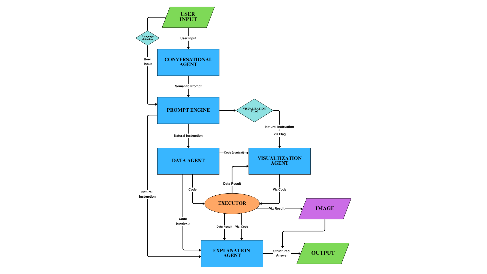

  

## Team Members
- **Chiara Canali** – Team Captain (ID: 800xxx)
- Leonardo Risica (ID: 800xxx)
- Emiliano Simonelli (ID: 800xxx)

**Master’s Degree in Data Science and Management**  
LUISS Guido Carli – A.Y. 2024/2025

# 1 - Introduction

SwarmPA is a multi-agent system developed as part of the Machine Learning course (A.Y. 2024/2025) at LUISS Guido Carli, in collaboration with Reply SpA. The project addresses a real-world challenge in the public sector: enabling intuitive, efficient, and explainable access to complex datasets from the Italian Public Administration (PA). These datasets contain rich, granular information about salary distributions, commuting patterns, income brackets, and digital access behaviors of public employees. However, navigating such data typically requires technical expertise and familiarity with programming tools—skills that most public sector workers do not possess.

To bridge this gap, SwarmPA provides an **end-to-end intelligent system** that transforms natural language questions into structured analytical results and visualizations, without requiring any technical input from the user. The system is designed with one clear objective: to **democratize access to public data analytics**, empowering even non-technical users—such as public officials, analysts, or administrative staff—to explore, interpret, and understand institutional patterns and trends.

The system adopts a **multi-agent architecture**, explicitly recommended by Reply SpA, and strategically leverages the capabilities of Large Language Models (LLMs). Each agent is specialized in a specific role, forming a modular and scalable pipeline where tasks are divided, delegated, and executed in a coordinated fashion. This design ensures clarity, robustness, and reusability of the workflow, while maximizing performance through specialization.

At the core of the system lies **Swarm**, an open framework for orchestrating agent-based workflows with LLMs. Swarm provides a lightweight but powerful interface for defining, managing, and coordinating multiple intelligent agents. Its main strength lies in abstracting communication and memory between agents, allowing each component to focus on its expertise while still cooperating as part of a larger process. Swarm was chosen because of its modularity, its native support for prompt-based agents, and its flexibility in handling sequential logic flows—ideal for our goal of chaining reasoning, code generation, execution, and explanation.

The complete analysis pipeline is as follows:
1. **Conversational Agent** – The entry point of the system. It interprets the user’s natural language question, extracts its semantic structure, and aligns it with the metadata and content of the datasets.
2. **Prompt Engine** – It reformulates the parsed intent into a precise, domain-specific instruction, bridging the gap between semantic interpretation and code generation.
3. **Data Agent** – Based on the refined instruction, this agent generates optimized Python code (using `pandas`, `numpy`, etc.) to query, transform, and analyze the relevant dataset.
4. **Executor** – A secure sandbox environment that runs the generated code and captures the resulting output (e.g., numeric value, table, distribution).
5. **Visualization Agent** (optional) – If the request involves graphical interpretation, this agent creates appropriate plots or charts (e.g., barplots, heatmaps) using `matplotlib` or `seaborn`, and saves the image.
6. **Explanation Agent** – The final step. This agent takes the numerical output and translates it into a clean, professional summary that explains the results in fluent, institutional Italian.

SwarmPA is therefore not just a question-answering tool, but a **cooperative intelligence system**, capable of transforming an open-ended request into structured, interpretable insights—both textual and visual. It combines the transparency of agent-based software with the power of modern language models, making it a powerful assistant for data-analysis and data-driven decision making in the public sector.

# 2 - Methods

The architecture of SwarmPA is based on a modular **multi-agent system**, where each component (agent) is responsible for a specialized task. The communication between agents is handled exclusively through structured natural language prompts, orchestrated by the Swarm framework. This modular structure ensures a clear separation of responsibilities, maximizes reusability, and exploits the full potential of LLMs in a robust and scalable way.

The system relies on five agents plus an execution tool:

### Conversational Agent
- **Model**: `gpt-4.1`
- **Temperature**: `0.3`
- **Prompt**: Translates user natural language queries into a formal semantic schema aligned with dataset metadata.
- **Function**: Interprets user queries, and—crucially—enriches them with context derived from both the **technical schema** of the datasets and a **semantic layer** built using `LlamaIndex`.
- **Indexing**: At startup, the system invokes a `build_or_load_index()` method that creates (or retrieves) an index of all uploaded CSVs. This index captures column names, value distributions, and textual characteristics, allowing for contextual disambiguation of ambiguous queries (e.g., resolving "regione" to the correct field).
- **Metadata schema**: Generated via `generate_dataset_schema()`, used to inform all agents of the structure of the data.

### Prompt Engine
- **Model**: `gpt-4.1`
- **Temperature**: `0.2`
- **Prompt**: Converts the semantic prompt into a clean, formal instruction in natural language, suitable for code generation.
- **Function**: Acts as the central interpreter between understanding and execution, making prompts clearer and executable. By explicitly separating this phase, the system gains **control, transparency, and consistency** in how analysis requests are passed to code-generating agents.
- **Impact**: This agent represents a major evolution in the architecture compared to the old system.

### Data Agent
- **Model**: `gpt-4.1`
- **Temperature**: `0.1` (lowest, for determinism)
- **Prompt**: Strict instruction to generate only valid, executable Python code using `pandas`, `numpy`, etc., without any text or markup.
- **Function**: Converts instructions into working code. Handles filtering, aggregation, joins, value counts, and even complex statistical operations. Ensures output is always printed and saved into the variable `result`.

### Visualization Agent
- **Model**: `gpt-4.1`
- **Temperature**: `0.4`
- **Prompt**: Generates Python code for creating visualizations from the resulting data (`dataframe_result`), using `matplotlib` and `seaborn`.
- **Function**: Dynamically determines the appropriate graph type (barplot, pie, heatmap, etc.) and saves it to `images/output_visualization.png`.
- **Trigger**: Activated only if the prompt contains visual keywords (e.g., “grafico”, “chart”).

### Explanation Agent
- **Model**: `gpt-4.1`
- **Temperature**: `0.5`
- **Prompt**: Expert-level explanation template that synthesizes numeric, tabular, or visual data into a structured and institutionally styled summary.
- **Function**: Provides fluent and coherent final answers. Integrates numerical interpretation, ranking, comparisons, and references to attached visualizations.

### Executor
- **Function**: A secure Python environment that executes dynamically generated code and returns the result (`result`, `dataframe`, or image).
- **Mechanism**: Uses a `try/except` block to trap execution errors and returns structured objects to be post-processed.

---
## Environment Setup

To ensure full reproducibility and clarity, this section outlines the setup instructions and the overall code structure of the system.

The project requires Python 3.10+ and can be set up using `venv` with `pip` and install all the requirements needed (`requirements.txt`). Below the instructions:

#### Set Virtualenv and install requirements

    python3 -m venv .venv
    source .venv/bin/activate  # On Windows: .venv\Scripts\activate
    pip install -r requirements.txt

> API keys such as OpenAI's should be stored in a `.env` file and loaded automatically using the `python-dotenv` package.

---

### Project Structure and Core Files

The system follows a clean and modular organization. The two core scripts are:

- `main.py`  
  This is the system's entry point. It instantiates the `SwarmAgentSystem` class and starts an interactive console interface. Running this script launches the entire multi-agent pipeline from user query to structured output (including code generation, execution, and explanation, optionally with a visual chart).

- `swarm_interface.py`  
  This file contains the logic of the main agent controller. It defines the `SwarmAgentSystem` class, manages the semantic context, builds the metadata prompts, and orchestrates the sequential interaction between agents using Swarm's internal client. It encapsulates the high-level system workflow in the `process_query()` method.

Other important components of the repository include:

- `agents/`: contains all agent builders and configuration (conversational, data, prompt engine, visualization, explanation).
- `utils/`: includes modules for code execution (`executor.py`), schema generation, indexing, and prompt loaders.
- `prompts/`: directory containing all agent-specific prompt files, written and tuned for agent specialization and semantic control.
- `datasets/`: directory containing the CSV files from the Italian public administration used for analysis.
- `images/`: stores all generated visualizations.

This structure is designed to separate concerns cleanly: orchestration, agent logic, execution, and resource configuration are all modular and extensible. It also aligns with agentic AI best practices, where prompt-based logic is decoupled from orchestration and execution.

### Workflow Diagram

The figure below provides a detailed illustration of the entire workflow, from input to output, precisely reflecting all the data exchanges and interactions among the components of the architecture, as defined in the `SwarmAgentSystem` within the orchestration code `swarm_interface.py`:

---

### Technical Stack

- **Swarm**: The core framework used to define, run and manage agentic interactions. Chosen for its elegant prompt-based agent abstraction and orchestration capability.
- **LlamaIndex**: Enables semantic indexing and retrieval of dataset structure and values. Critical for enriching the parsing phase of the Conversational Agent.
- **Pandas, NumPy**: Core analytical libraries for tabular manipulation and statistics.
- **Matplotlib, Seaborn**: Used by the Visualization Agent for rendering static, readable charts.
- **dotenv**: Loads environment variables and manages API credentials.

---

### User Interface

The system is accessible through a user-friendly web interface built with Streamlit (https://triple3-rfr6bswwrbu2wpqfgwvwag.streamlit.app/). Users can input their queries in natural language and receive instant feedbacks:

The interface provides a chat-like experience, allowing users to interact with the system in a conversational manner. It also supports downloading generated charts and explanations as PNG files.

---

### Datasets Focus

The system is designed to work with four representative datasets from the Italian Public Administration:
1. **Salaries**: Aggregated salary data, including payment methods, administrative offices, demographics, and municipalities.
2. **Income Segments**: Data on civil servants distributed by income brackets, regions, and tax rates.
3. **Digital Access**: Records of public employees accessing online government services (SPID, CIE, etc.).
4. **Commuting**: Data about work-site proximity, administrative units, and estimated distances for employees.

These datasets are semantically indexed using LlamaIndex to ensure efficient querying and analysis.

---

### Comparison with the Legacy System

The development of SwarmPA was preceded by an earlier architecture based on **LangChain**, available at [emisimonelli/agents](https://github.com/emisimonelli/agents). The initial system was functional and technically solid, demonstrating many advanced capabilities:

**Strengths of the legacy project:**
- Integrated memory (via `ConversationTokenBufferMemory`)
- Custom chains (`LLMChain`) for reasoning and document querying
- Componentized architecture with `ConversationalAgent`, `DocumentAgent`, `VisualizationAgent`, and a centralized `MultiAgentSystem` class
- Use of LangChain’s standard tools for prompt templates and fallback chains

**Limitations:**
- **Hardcoded logic**: Each phase had explicit procedural transitions, reducing flexibility.
- **Overhead and complexity**: Many chains and prompt calls were wrapped in verbose execution paths.
- **Tight coupling**: Most components were manually interconnected, which made debugging and extension harder.
- **Prompt generation and flow were interleaved**, which made the system more fragile under ambiguous queries.

These limitations—especially regarding scalability, transparency of logic, and modularity—combined with our relative inexperience and the desire to build a system that is easier to understand, maintain, and extend, led us to adopt the **Swarm framework** as the final architecture. With Swarm, each component becomes an independent LLM-powered agent, and the entire flow is governed by well-defined natural language prompts. This not only maximizes the interpretability of the system, but also allows us to fully exploit the reasoning capabilities of large language models in a modular and controlled way.

### Key improvements in the SwarmPA architecture:
- Fully decoupled modules
- Transparent and inspectable communication via text prompts
- Easier to debug, extend, and control
- Improved interpretability, both during execution and from a design perspective
- Seamless integration of **Prompt Engine**, which simplified the instruction flow and made the entire system more robust

---

## Optional Enhancements and Design Challenges

- **Memory Support**: Inspired by LangChain’s token memory, attempts were made to integrate `ConversationTokenBufferMemory` into Swarm agents. However, Swarm does not support memory injection natively, and integration caused runtime conflicts. As a workaround, a **temporary memory mechanism** called `combined_input` was implemented, which prepends previous instructions from the prompt engine `natural_instruction` to new ones `user_input`in a controlled and coherent format.
- **Fallback Logic**: A recovery pipeline was also tested—where failed code generation would trigger a reformulated prompt and a second attempt. However, this retry logic introduced new ambiguity and occasionally reduced stability. It was ultimately removed for robustness.

---

SwarmPA therefore represents a **second-generation agentic system**, where the lessons of the LangChain-based prototype were refined into a clearer, more powerful architecture. Its agent-based prompt orchestration, semantic parsing, dynamic code generation, and explanation logic all contribute to a system that is not only functional, but also transparent, extensible, and aligned with modern LLM best practices.
